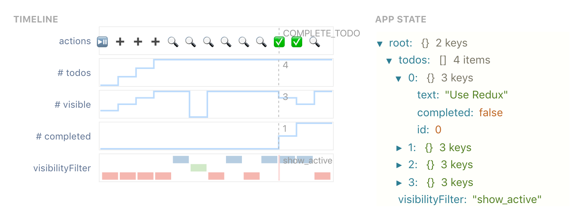

# 6.894 FP: UI Execution Visualization

By Geoffrey Litt, glitt@mit.edu

* [📹 Video demo](https://www.loom.com/share/e5df0b7ba47240e3ac9f5ceb9316ec53)
* [📄 Final Paper](paper/paper.pdf)
* [⏯ Live Prototype](https://github.mit.edu/pages/6894-sp20/FP-Program-Execution-Visualization/)

Visualizing the runtime behavior of programs can help programmers with targeted debugging and general understanding. For understanding complex programs, visualizations abstracted from the low-level code are most helpful, but this introduces new challenges: how does the programmer specify what to visualize, and how do we visualize complex data structures which aren't just primitive values?

In this work, I present an approach to visualizing the behavior of user interfaces built with the Model-View-Update pattern. I present a prototype runtime visualization system built on the Redux library and argue that, by exploiting the natural abstraction characteristics of this application architecture, we can create useful runtime visualizations with minimal programmer effort.



## Development

To run locally:

```
npm run start
```

To deploy to Github pages:

```
npm run deploy
```
