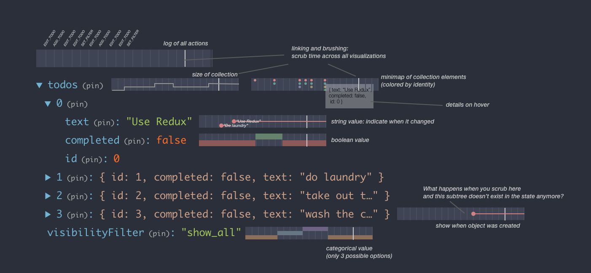
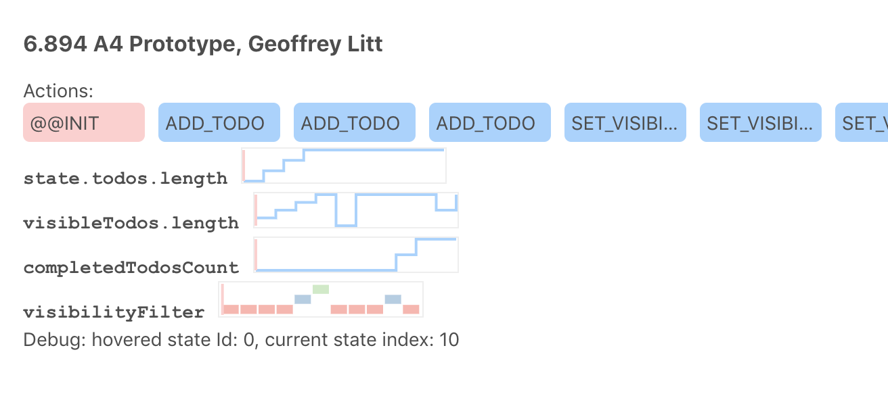

# 6.894 FP: Redux Visualization

A final project repo for 6.894 Interactive Data Visualization at MIT

By Geoffrey Litt, glitt@mit.edu

[✨ Live demo link](https://github.mit.edu/pages/6894-sp20/FP-Program-Execution-Visualization/)

## Problem statement

Often, the best way to understand a program is to see the data inside as it runs.
This is particularly true for interactive systems, where you can
play with a UI and get a sense for what happens as you provide different inputs.

In Bret Victor's seminal work [Learnable Programming](http://worrydream.com/LearnableProgramming/),
he convincingly demonstrated a vision of making program state visible, and made the simple yet profound observation that program runtime visualization is merely an instance of the general problem of data visualization, making it amenable to all the standard techniques of data vis.

Victor's work was a roadmap more than a specific implementation; since that publication, projects like [Theseus](https://dl-acm-org.libproxy.mit.edu/doi/10.1145/2556288.2557409)
and [Python Tutor](http://www.pythontutor.com/) have tackled some of the challenges of executing on this vision. A particular inspiration for this project is [Augmenting Code with In Situ Visualizations to Aid Program Understanding](https://dl-acm-org.libproxy.mit.edu/doi/10.1145/3173574.3174106), by Jane Hoffswell, Arvind Satyanarayan, and Jeffrey Heer, which proposed a design space for visualizations of program state included inline with source code.

Despite the progress made by those projects, certain important limitations remain, which I aim to explore with this project. Here are some principles/goals:

### Visualizing general UI code

I aim to visualize the behavior of interactive UIs built with the [Redux](https://redux.js.org/) Javascript library (also known as the [Elm Architecture](https://guide.elm-lang.org/architecture/). My hypothesis is that this domain is broad enough to be widely useful, but narrow enough to make it substantially more tractable than the general problem of visualizing arbitrary programs.

Some other systems like Python Tutor aim to visualize arbitrary programs, which forces them to focus on low-level details and doesn't allow them to make strong assumptions about what the program does. On the other hand, Hoffswell/Satyanarayan/Heer's work focuses on the narrower domain of data visualization, which limits the applications of their work. I'm aiming for a middle ground.

### Higher-level visualizations

All of the above work focuses primarily on visualizing in the context of viewing the actual source code.
This means the scope of visualization is limited to the code that's visible on the screen.
In standard languages like Python or Javascript this necessitates a fairly zoomed-in, low-level visualization
which can't explain the entire behavior of the system. In Vega the situation is better given the declarative
nature of the language, but being tied to source code text still limits how broad a visualization can be.

In this work I aim to capture a more zoomed-out view decoupled from source code.
The mechanism for enabling this is provided by the Redux architecture, which
encourages the entire UI state to be captured in a centralized object,
and all UI actions to go through a single dispatcher. Redux apps are usually
split up across many files, but this centralized state and stream of actions
provides a useful focus for visualizing the essence of the system,
as defined by the programmer.

[Redux Devtools](https://github.com/reduxjs/redux-devtools) is an existing
project by the Redux team that exploits this exact principle to provide
a highly useful debugging experience for Redux apps, including inspecting
state and "time-travel debugging" by returning to previous app states.
However, the views of state provided by the tool are quite primitive.
When using the tool myself, I often struggle to find the exact previous state
that I want to return to, and find myself scrubbing back and forth
in time. My plan is to build on the existing Redux Devtools and
add data visualizations to help better answer this question of
"what did prior states look like, and where is the one I wanted to return to?"

_todo: create a fuller list of user questions I aim to answer_.

### Complex objects, non-numeric values

Many runtime visualization projects focus on example programs which have
relatively simple state shape, with lots of numeric or graphical values that are
easy and pretty to visualize.

However, many real-world programs don't fit this profile. Many UIs contain
highly complex nested data structures, with many non-numeric values in them.
Visualizing these structures remains an open challenge for runtime
visualization. I aim to use the fundamental data visualization principles
we've learned in this class to explore new techniques for effectively
visualizing thse types of data.

My initial test program is the TodoMVC UI benchmark. It's not particularly
complex, but it at least has some nested data structures and lots
of non-numeric data. Time permitting, I hope to test out my visualization
system with other more complex applications.

## Mockups

Here are some initial ideas for how to visualize program state in this context. Some key ideas represented here:

* Show the current state of the application in a JSON tree
* Inline, next to nodes of the tree, show small sparkline-style visualizations that show the state of that subtree back in time
* For nodes that represent a collection, provide different (customizable?) summarization options. For example, the todos array here could be summarized by a line graph of the number of todos, or a graphic that represents each unique todo with a colored dot.
* Allow linked brushing across all the mini visualizations, to explore how changes occured in different parts of the state across time



## Prototype Implementation

This repo currently packages:

* The Redux implementation of TodoMVC, copied from [here](https://github.com/reduxjs/redux/tree/master/examples/todomvc)
* The [Redux DevTools](https://github.com/reduxjs/redux-devtools) system for managing Redux state
* My own custom prototype "monitor", exploring these new ideas for visualizing Redux state

I've set up a lot of plumbing to hook in my custom monitor to Redux,
and now can quickly create arbitrary d3 visualizations of
subsets of the application state, all linked together.



## Development

To run locally:

```
npm run start
```

To deploy to Github pages:

```
npm run deploy
```
