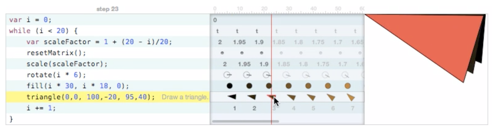
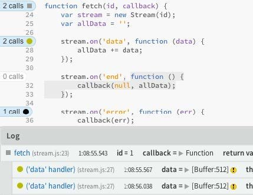
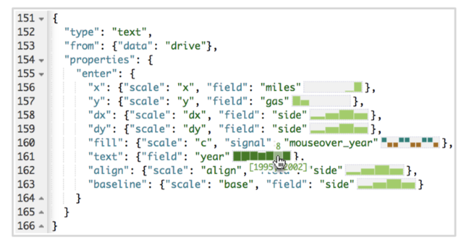
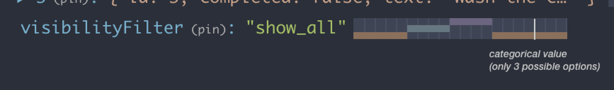
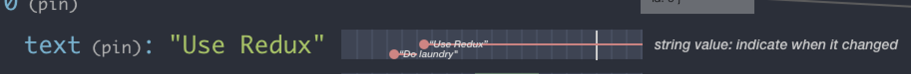
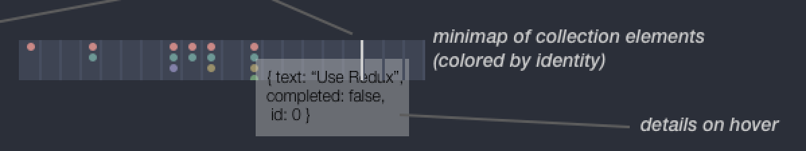

# 6.894 FP: UI Execution Visualization

A final project repo for 6.894 Interactive Data Visualization at MIT

By Geoffrey Litt, glitt@mit.edu

[⏯ Live demo link (early prototype)](https://github.mit.edu/pages/6894-sp20/FP-Program-Execution-Visualization/)

[📹 Video demo (early prototype)](https://www.loom.com/share/164ad22b95554784bf06919781ec3fe5)

## Problem statement

Often, the best way to understand a program is to see the data inside as it runs.
This is particularly true for interactive systems, where you can
play with a UI and get a sense for what happens as you provide different inputs.

Many research projects have explored ideas in this area:

[Learnable Programming](http://worrydream.com/LearnableProgramming/) by Bret Victor, which identified runtime data visualization as a key component of making programs understandable, and inspired much of the subsequent work in this area:



[Theseus](https://dl-acm-org.libproxy.mit.edu/doi/10.1145/2556288.2557409), by Tom Lieber, Joel Brandt, and Rob Miller, which proposed an "always-on debugger" for Javascript web UIs:



[Python Tutor](http://www.pythontutor.com/), by Philip Guo, which visualizes the memory state of Python programs (and other languages):


[Augmenting Code with In Situ Visualizations to Aid Program Understanding](https://dl-acm-org.libproxy.mit.edu/doi/10.1145/3173574.3174106), by Jane Hoffswell, Arvind Satyanarayan, and Jeffrey Heer, which proposed a taxonomy/design space for visualizing program state inline with source code:



Despite the progress made by these projects, there are important research questions in this space which haven't been fully addressed yet, which I aim to explore in this project:

### How can we visualize generic user interfaces?

Some other systems like Python Tutor aim to visualize programs of any kind. This forces them to focus on low-level details like individual variables and lines of code, which makes them more useful for beginner programmers understanding how Python works than for an experienced programmer trying to understand a large Python program. By focusing on UIs as a specific category of program, I hope to provide useful constraints leading to more useful visualizations.

On the other hand, Hoffswell et al focus specifically on people writing data visualization programs in Vega; this allows them to make very strong assumptions and create a higher-level view of the system's behavior, but limits the applicability of the tool to a single domain. By focusing on more general UIs, I hope to create visualizations with broader applications.

My target domain is any interactive web application built with the popular [Redux](https://redux.js.org/) pattern (also known as the [Elm Architecture](https://guide.elm-lang.org/architecture/). This pattern imposes some useful constraints on how UI logic is organized, while also remaining general enough to support a vast variety of UIs, ranging from video games to business apps. It also provides some pragmatic implementation constraints that prove convenient for implementing visualizations.

### How can we visualize abstract conceptual state, not low-level state?

Many runtime visualizations are fairly low-level, focusing on
individual lines of source code or variable values (see the Python tutor
example above for one example). This is especially true when
the visualization is linked to the source code—if the code
doesn't fit on one screen, the data can't be runtime-visualized on one screen.
Hoffswell et al achieve a higher level of abstraction by working with
the declarative Vega language, but by tying their visualization to
source code, they still limit how far they can zoom out.

Unfortunately, most complex UIs have logic spread across many files,
making the inline source code view impractical for visualizing
overall system behavior.

In this work I aim to capture a higher-level view of a system's behavior, decoupled from source code. This begs the question: how to obtain this
higher-level view—which details are important, and which ones can be omitted?

The Redux architecture offers a convenient mechanism for starting to answer
this question. It encourages the entire core UI state to be captured in a centralized object, and all UI actions to go through a single dispatcher. Redux apps are usually
split up across many files, but this centralized state and stream of actions
provides a useful focus for visualizing the core essence of the system,
as defined by the programmer, and eliminating unnecessary details.

As one example of this: in TodoMVC-Redux, when a user is typing in a new todo,
a Redux action is only triggered when they hit enter; the process of building
up the todo character by character is considered local state and is managed
privately by the text input component. This means that adding a todo
is registered as a single atomic action in the system's history.

[Redux Devtools](https://github.com/reduxjs/redux-devtools) is an existing
project by the Redux team that exploits this principle to provide
a useful debugging experience for Redux apps, including inspecting
state and "time-travel debugging" by returning to previous app states.
However, the views of state provided by the tool are primitive,
mostly amounting to a rich viewer for raw JSON data.
When using this DevTools myself, I often struggle to find the right previous state
that I want to navigate to, and find myself scrubbing back and forth
in time.

My plan for this project is to build on the existing Redux Devtools infrastructure and add data visualizations to help better answer questions like:

* how did the system's core state change over time?
* where is the prior state that I want to navigate back to?

### How can we visualize complex objects and non-numeric values?

Many runtime visualization projects focus on example programs which have
relatively simple state, with many primitive numerical values that are
a natural fit for data visualization.

However, many real-world programs don't fit this profile. Many UIs contain:

* highly nested data structures: many collections and key-value objects
* many non-numeric values: strings, booleans, enums/symbols

Visualizing these structures remains an open challenge for runtime
visualization. I aim to use the fundamental data visualization principles
we've learned in this class to explore new techniques for effectively
visualizing these types of data in the context of real UIs.

Often, precision isn't particularly important in these visualizations—
the user is looking for general patterns, not to make precise
comparisons between quantities. This might provide hints for
appropriate visual encodings to consider, eg using color heavily.

My initial test program is the TodoMVC UI benchmark app. It's not particularly
complex, but it at least has some nested data structures and lots
of non-numeric data, and represents many of the typical characteristics of
generic web UIs. Time permitting, I hope to test out my visualization
system with other more complex applications.

## Mockups

Below is a mockup illustrating some initial ideas:

* Show the current state of the application in a JSON tree view
* Next to tree nodes, show small sparkline-style visualizations that show the state of that node back in time
* For collection nodes, provide different (customizable?) summarization options. Hoffswell et al's taxonomy provides more ideas for visualizing numeric
collections, but we need ways to visualize collections of nested objects
and non-numeric values.
* Allow linked brushing across all the mini visualizations, to enable the user to connect data at the same point in time across different graphs


Enum values with small numbers of possible values (eg, the todo filter state)
could be represtented with this kind of visualization showing
changes over time:



Sometimes, values like strings are hard to aggregate, but they also change
rarely, creating the opportunity to show the entire string value
along with showing when it changed:



One idea for summarizing a small collection is to show dots representing members,
each with a stable color over time. This gives a sense of collection length,
but also could help illustrate sort order, insertion/deletion over time, etc.



One area I haven't explored much yet is allowing the programmer to customize
what state gets visualized. An initial starting point would be letting them
write arbitrary expressions over the app state, and choosing a type of graph
to visualize them with. Part of the idea behind this work is that
an application author could put work into creating an app-specific view
of state, as a form of "live documentation".

## Generalizing further

Upon reflection, many of the ideas I've explored so far aren't particularly
coupled to the Redux architecture. It should be possible to generalize further
and reduce any UI down to small pieces of important state that can be visualized over time using these techniques.

One potential future deployment path is in [WebReplay](https://webreplay.io/), an
emerging technology for record-and-replay debugging in the web browser.
They offer the ability to retroactively add/edit `console.log` statements
in Javascript code and have those statements execute on previously recorded
execution traces. Currently their views for navigating execution traces
are fairly limited, so it can be hard to understand and navigate the trace;
I've been discussing with the team working on that project the possibility
of implementing some of these visualizations on top of that technology.


# Prototype Implementation

I've started some early code prototyping of these ideas. See the links at the top of this repo for a live demo link and video demo.


This repo currently packages two pre-existing components:

* The Redux implementation of TodoMVC, copied from [here](https://github.com/reduxjs/redux/tree/master/examples/todomvc)
* The [Redux DevTools](https://github.com/reduxjs/redux-devtools) system for managing Redux state

On top of that, I've built a panel exploring new ideas for visualizing Redux state. It usees React to manage most of the UI, and D3 + svg for the sparkline visualizations.


## Development

To run locally:

```
npm run start
```

To deploy to Github pages:

```
npm run deploy
```
