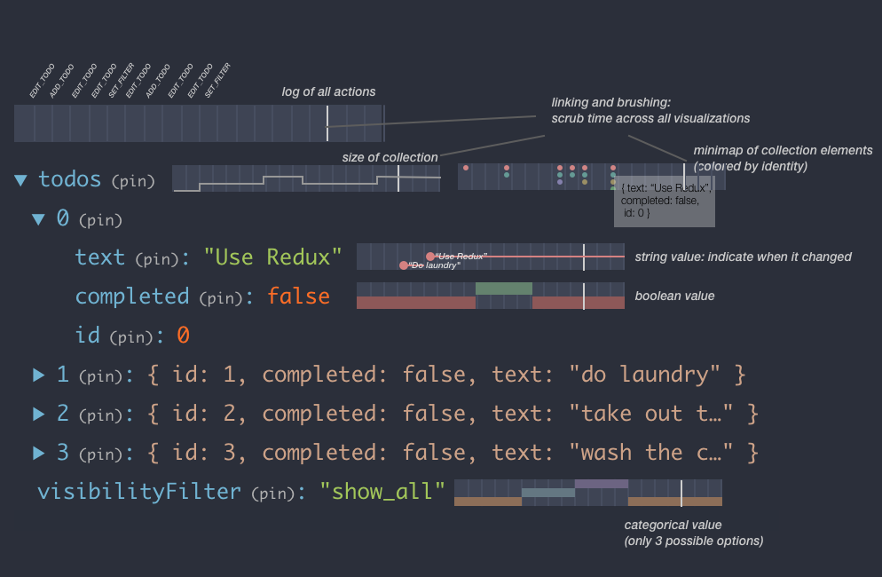
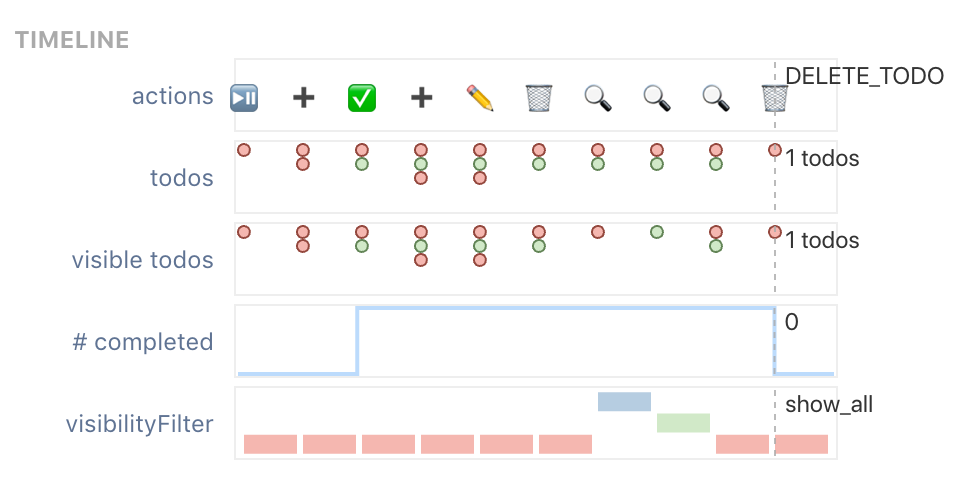

# Introduction

Much recent work in program visualization [@victora; @guo2013; @hoffswell2018a; @pollock2019; @kasibatla2018] focuses on low-level details: showing the values of individual variables, connected to individual lines of source code. This works well for small programs, and for helping novices understand the basics of programming. But these visualizations don't address the needs of more experienced programmers working with larger programs. Gaining a general understanding of a large program requires zooming out from individual lines of code.

This leads to the idea of _abstract program visualization_: creating abstract, program-specific views of runtime state or static code, to help someone debug or understand the program. This idea has been explored in the context of teaching algorithms [@brown1984; @stasko1990] and understanding the behavior of multithreaded Java programs [@reiss2003; @reiss2005]. But abstract visualizations create a new challenge [@reiss2007]: how can we enable the programmer to create program-specific abstract visualizations with minimal effort? On the one hand, overly generic visualizations (as used in most low-level visualization systems) will often fail to capture the higher-level meaning of the specific program. On the other hand, if a visualization takes too much work to create, it won't be realistic for programmers to create the visualization in practice.

I think a promising strategy for approaching this problem is to create runtime visualization systems coupled to a particular domain-specific framework or DSL. Frameworks and DSLs occupy an intermediate place between general-purpose languages and specific programs. They often impose a particular mental model, code architecture style, and other constraints that usefully narrow the space of possible programs relative to a general-purpose language. On the other hand, there are still many different programs that can be built in one framework, so the effort of building a visualization system can be amortized over thousands of programs rather than concentrated on a single one.

To concretely test this strategy, in this work I propose a runtime program visualization system for user interfaces built with the Model-View-Update (MVU) architecture [@fowler2020], also commonly known as the Elm Architecture [@czaplicki]. MVU encourages the state of the interface to be centralized in a single data structure, derived by running a pure reducer function over a stream of events.

This architecture has many practical benefits for program understanding and developer experience (e.g., automatically achieving time-travel debugging), and I think it has useful characteristics for abstract program visualization as well. In particular, MVU naturally encourages programmers to define abstractions that represent the essence of their application's behavior: 1) a stream of semantically meaningful events, 2) a state object that represents all the core state of the UI. My hypothesis is that it is possible to visualize MVU interfaces with relatively little additional effort from the programmer, because the architecture has already required them to do much of the work of abstracting.

I've prototyped a runtime visualization system on top of the popular Redux [@zotero-621] library, which implements MVU in Javascript. Within the limited scope of this project, I've focused on making a prototype specifically designed to visualize the state of the TodoMVC demo application. I've designed some visualizations tailored to the state of that application, and through my own usage I've begun to gain a preliminary understanding what kinds of visualizations might be useful to programmers navigating execution traces of MVU applications.

Much future work remains to fully flesh out this idea, including developing a crisper understanding of the needs of programmers, validating this system against those needs, and generalizing the system so that it actually works with many Redux applications instead of just one demo app.

# Related Work {#sec:related-work}

Reiss [@reiss2007] provides a useful taxonomy of execution visualizations, with pointers to prior research. Some particularly relevant dimensions for this work include abstract vs concrete, and effort required to create the visualization.

Many systems have explored visualizing execution state at the level of individual source lines, including Learnable Programming [@victora], Python Tutor [@guo2013], Omnicode [@kang2017], Theia [@pollock2019], and Theseus [@lieber2014].

Some systems have explored somewhat more abstract views. Projection Boxes [@lerner2020 provides a way of selectively showing parts of application state, and Seymour [@kasibatla2018] provides a "macro" visualization to generally show the layout of execution flow, in addition to a "micro" visualization.

This work aims to provide a much more abstract view of the application's behavior than any of these other projects, by avoiding doing any visualization at the level of individual lines of code.

Other systems have explored this kind of abstract program visualization, entirely disconnected from the source code. For example, Balsa [@brown1984] and Tango [@stasko1990] show animated views of algorithms operating, and Jive [@reiss2003] and Jove [@reiss2005] visualize various high-level projections of the execution of Java programs, e.g. when different threads are running.

I'm not aware of much prior research on abstract program visualization for user interfaces, although I still need to do a fuller literature review. UI performance analysis tools or debuggers like the Redux Dev Tools arguably fit into this category, but there aren't many tools that employ data visualization techniques to display the internal state of the application.

Hoffswell et al propose a system for visualizing runtime state inside Vega data visualizations [@hoffswell2018a]. That work fits into the category of visualizing state next to source code lines, but by integrating with a very high level domain-specific language, achieves more abstraction than visualization systems for general languages like Python. They also propose a design space for visualizations embedded in source code, which I plan to build on in this work.

# Visualization design {#sec:design}

## Use cases

I had some prior experience with the Redux Dev Tools debugger, which provides the ability to inspect application state in Redux applications. From this personal experience, I identified two distinct use cases for a runtime visualization:

* **Localizing within a trace**: _Where do I need to rewind to, in order to inspect a particularly relevant point in an execution trace?_ This is most often helpful when debugging a particular problem. Scrubbing back and forth while watching the UI change is often workable, but it's inefficient. Also, sometimes the relevant state isn't directly visible in the UI, so I need to dig into a JSON object at each point in time to understand whether I've found the right point in the trace.
* **Generally understanding program behavior over time**: _Overall, what happened as I interacted with the program?_ Sometimes I'm not debugging a particular problem, and I'm more interested in just seeing general information about how a program is behaving over time. For example, this is helpful when explaining the system's behavior to a new programmer who's preparing to work on the system, or when I'm trying to learn the basics of a codebase myself.

These two goals partially overlap, but can also lead in different design directions. For example, localizing a specific point in a trace can benefit from a more active interrogatory approach (e.g. as explored in the Whyline system [@ko2004]), but general program understanding might benefit from a more passive style, more akin to reading documentation but accompanied by live demonstrations.

## Data structures

Many concrete and low-level program visualizations focus on showing primitive values, especially numeric values. However, the state of an arbitrary MVU application often contains complex nested data structures, which contain many non-numeric values: booleans, strings, and enum values. One challenge for this system is to find ways to visualize these types of structures.

## Context: TodoMVC

In order to focus my effort on concretely understanding the utility of visualizations, rather than building out infrastructure, I built a visualization system for a specific application: the TodoMVC GUI benchmark. TodoMVC is a basic todo list UI where the user can add, edit, delete, and complete todos. The user can also filter the list of todos shown to either active or completed ones.

The Redux implementation of TodoMVC stores an app state object which contains the list of todos, and the current state of the visibility filter. There are actions corresponding to each of the main user interactions listed above, e.g. "add todo" and "set visibility filter". Importantly, the Redux events capture an abstract, semantically meaningful picture of the user's interactions: when adding a new todo, the user's keystrokes are collected in the local state of a React component, and only a single "add todo" event is triggered in Redux once the user finally adds the new todo.

## Overall layout

{#fig:mockup width=330px height=216px}

My initial idea, as shown in [@fig:mockup], was to show the current state of the application as a nested JSON tree, and then to show small sparkline-style visualizations next to nodes of the tree. This design draws some inspiration from [@hoffswell2018a], but differs in that it uses visualization to annotate the application's state tree, rather than its source code. The advantage of this design is that it closely and directly links the current state to data from the execution history, but that link also causes thorny problems—for example, how do you deal with nodes that have disappeared from the current state? Perhaps more concerningly, by tying the visualization to the _concrete_ current state, it limits the ability of the programmer to create a customized abstract view, removed from the details of the state.

In my next iteration I switched to a different layout, shown in [@fig:timeline]: a vertically stacked list of small visualizations of state over time. Each visualization can display an arbitrary projection of the app's Redux state. Because the graphs are horizontally aligned, it's easy to see how different aspects of the app's state have changed in relation to each other. While I haven't implemented this yet, I imagine that programmers would be able to dynamically add visualizations to this list, specifying useful projections of app state, and deciding what type of visualization to use for each projection.

{#fig:timeline width=330px height=170px}

One thing lost in the timeline view is the concrete view of the app's entire state. It's still useful to see this, so I added a separate panel which displays that data. The user can scrub through history in the timeline, "pin" the app state at a particular point in time, and then use the separate state view to drill into the app's concrete state at that point.

## Visualization Types

Here I describe the specific visualizations I prototyped for the timeline view. These are shown in [@fig:timeline] from top to bottom. (The video demo linked on the project page might be an easier way to grasp the basics of each of these views)

_Action list_: I found that skimming a list of actions represented as text (`ADD_TODO`, `EDIT_TODO`, etc.) required a lot of conscious reading effort. Instead, by choosing a colorful symbol for each action in the app, we can take advantage of pre-attentive processing to more quickly understand what actions have occurred in the execution trace. In this case I chose symbols for all the actions in TodoMVC; more generally, a programmer could specify a meaningful symbol for every action in their application. In some cases it might be difficult to choose meaningful and different symbols for all actions; falling back to random symbols or colored dots could work as well. In using this tool I've found that the symbolic action list makes it far easier to find a point in an execution trace that I'm looking for.

_Collection graph_: This visualization represents the contents of a collection with a series of vertically stacked dots. The size of the cluster of dots provides a rough sense of collection size, and the programmer can more carefully examine the view to get an exact count.

Each dot has a color encoding for some attribute of the collection element; in this case I've chosen to color the dots by whether the todo is completed or not. Another available option is to color the dots by identity—each unique element gets its own color.

I originally represented the list of todos with a line graph showing its length, but this view allows us to display an additional dimension of information for each todo. One corresponding weakness of this view is that the size encoding doesn't offer too much information for pre-attentive processing when there are more than a few elements so the relative size change is small. It's not immediately obvious where in the trace the number of todos changed, whereas a line graph makes it more obvious. (One possible improvement would be to only show the dots on a time step where the collection was changed.)

_Line graph_: This is simply a line graph of some numeric quantity over time. In this context I've used it to visualize quantities like "Number of todos visible". Choosing a y-axis is quite tricky because the full range of values can't be known in advance. In trying out different options and using the tool myself, I decided that viewing relative changes over time was most important—generally I'm looking for things like "when did the number of todos go down?". Therefore, I let each graph scale to the current range of values and don't even show a y-axis label—I'm not aiming to precisely read numeric values off the graph.

_Enum graph_: User interfaces commonly have enums / union types, which can take on a small number of predefined values. To represent enum values changing over time, I chose to use both a color and position encoding, as a way of redundantly encoding the information and .

With more time, I'd like to explore many other types of visualizations in addition to these. One particular interest is displaying the entire state of a collection of objects in a single graph.

## Prototype Implementation

I implemented a working prototype on top of the existing Redux Dev Tools, which provides substantial infrastructure for inspecting and manipulating the state of a Redux application. My tool is implemented as a Redux Dev Tools "monitor" which can plug in to those existing APIs.

I used the React and Redux frameworks to implement the main skeleton of my system. The graphs are built in a combination of d3 and React. I use d3 for computing scales and positions, and then React for actually rendering out SVGs.

## Discussion and Future Work {#sec:discussion}

This work is still an early prototype and there are many opportunities for future work.

Using this system myself, I found that I was able to more quickly get an overall sense of what happened in an execution trace by looking at these visualizations than looking at the existing Redux Dev Tools display. However, I want to gain a clearer understanding of what questions people have when learning about the behavior of a UI, in order to evaluate the usefulness of the system. In particular, I'm curious about general "program understanding" as opposed to targeted debugging. Could this visualization be a useful aid when onboarding someone into a codebase and teaching them how it works?

There's lots of future work to refine the core visualizations further. I haven't yet explored visualizing a complex object in a single graph, or showing strings changing over time. I'd also like to more clearly incorporate Hoffswell et al's taxonomy [@hoffswell2018a] into this work, evaluating these visualizations in those terms and explicitly extending that taxonomy.

Another area of work is generalizing this system to work with any Redux application. I'd like to explore the programmer experience of creating these visualizations for an existing complex application. How much of that process can be automated? How can we make it easy for the programmer to decide which visualizations would be helpful, and then to actually specify those visualizations? As an initial idea, I imagine that the programmer could specify an arbitrary expression over the Redux state,choose from a predefined list of visualizations for showing the output of that expression, and then add that to the timeline panel in this tool.

Program visualization offers a rich set of possibilities for helping people understand their code better. In this work, I've provided an initial prototype of a system for visualizing the runtime state of Model-View-Update user interfaces, exploiting the natural architecture of these applications to show an abstract picture of code execution over time.
